🚀  Sparkly AI — Chat-to-Website Builder 🚀 

Create apps and websites by chatting with AI. Sparkly turns plain-English prompts (e.g., “Create a Calendar app”) into a working UI scaffold and example backend, with a live preview and file explorer so you can iterate fast.

⸻
```text
✨ Features
	•	Chat-to-Build: Drive generation with natural language prompts.
	•	Live Preview + File Explorer: Inspect files, view code, and see UI updates in one flow.
	•	Opinionated Templates: Curated React + Node prompts for fast bootstrapping.
	•	Secure API: JWT cookie auth, CORS allow-list, and rate limiting.
	•	Modern Frontend: React 18 + TypeScript + Tailwind + Vite.
	•	Dev UX: Dark mode, keyboard shortcuts, progress tracker, error boundary.
```
⸻


## 🧱 Monorepo Layout
```text
📦 sparkly-ai-website-builder
├── 🎨 frontend/ — Vite + React + TypeScript + Tailwind
│   ├── 🖼️ public/images/ → Demo screenshots (used in README)
│   └── 💻 src/
│       ├── 📑 pages/ → AppShell, ChatInterface, WebsitePreviewExplorer
│       ├── 🧩 components/ → FileExplorer, CodeViewer, Preview, etc.
│       ├── 🛠️ hooks/ → useBuildSession, useKeyboardShortcuts, etc.
│       └── ⚙️ context/ → Theme, App, Toast
└── ⚡ backend/ — Express + TypeScript
	└── 💻 src/
		├── 🔀 routes/ → /api/session, /api/chat, /api/template
		├── 🎛️ controllers/ → Claude calls, template/chat handlers
		├── 🧱 middleware/ → JWT auth, CORS, rate limiter
		└── 🔧 config/ → dotenv, cors config, Anthropic SDK
```

⸻

🚀 Quickstart
```text
Prerequisites
	•	Node.js 20+
	•	Anthropic API key (Claude)
```
1) Backend (API)

```code
cd backend
npm install
```

```code
# .env (example)
cat > .env <<'EOF'
CLAUDE_API_KEY=sk-ant-...
JWT_SECRET=please_change_me
NODE_ENV=development
PORT=3000
EOF
```

# compile & run
```code
npm run dev
```
# → http://localhost:3000

Mounts (src/app.ts):
```text
	•	GET /api/session → sets an HTTP-only JWT cookie
	•	POST /api/chat (auth required) → sends chat messages to Claude 3.7 Sonnet
	•	POST /api/template (auth required) → returns an artifact bundle + UI blocks
	•	GET /health, GET /health/log
```

Security
```text
	•	Helmet, rate limiting (100 req / 15 min), cookie-parser
	•	CORS allow-list: http://localhost:5173, 5174, 3000 (see src/config/cors.config.ts)
```

2) Frontend (Vite + React + Tailwind)
```code
cd frontend
npm install
npm run dev
# → http://localhost:5173
```

src/config.ts:
```code
export const BACKEND_URL = "http://localhost:3000";
```
Routing: src/pages/AppShell.tsx lazy-loads:
	•	src/pages/ChatInterface.tsx
	•	src/pages/WebsitePreviewExplorer.tsx

Core UI: src/components/WebSitePreviewDetails/*
FileExplorer, CodeViewer, Preview, BuildProgressBar, KeyboardShortcutsHelp, ThemeToggle, etc.

⸻

🧭 End-to-End Flow
```text
	1.	Init session → Frontend calls /api/session to get a short-lived JWT cookie.
	2.	Prompt → User types “Create a Calendar app.”
	3.	Backend → POST /api/template uses curated prompts (backend/src/prompts/*) to call Claude (claude-3-7-sonnet-20250219).
	4.	Artifact → UI → Response includes files/steps/UI blocks; frontend updates File Explorer, Code Viewer, and Preview with progress.
	5.	Iterate → Keep chatting via POST /api/chat to refine or add files. Keyboard shortcuts speed navigation.
```
⸻

🔌 API Reference
```code
GET /api/session
	•	Mints a JWT and sets it in an HTTP-only cookie.
	•	Set secure in production.
```

```code
POST /api/chat

{
  "messages": [
    { "role": "user", "content": "Create a header with CTA" }
  ]
}
```

Returns a Claude TextBlock-like payload.
```code
POST /api/template

{ "prompt": "Create a Calendar app" }
```

Returns an artifact bundle + UI prompt blocks composed from:
	•	prompts/reactPrompts.ts
	•	prompts/nodePrompts.ts
	•	prompts/basePrompts.ts

Auth: Both /api/chat and /api/template require the JWT cookie
(fetch with credentials: 'include').

Example fetch (frontend):
```code
await fetch(`${BACKEND_URL}/api/template`, {
  method: "POST",
  headers: { "Content-Type": "application/json" },
  credentials: "include", // IMPORTANT: send cookie
  body: JSON.stringify({ prompt: "Create a Calendar app" })
});
```

⸻

🛡️ CORS & Auth Notes
	•	Dev allow-list in backend/src/config/cors.config.ts.
	•	Frontend requests should use credentials: 'include'.
	•	JWT validation: backend/src/middleware/authenticateJWT.ts.
	•	Rate limiting: backend/src/middleware/rateLimiter.ts.

⸻

🖼️ View Components — Public Images

Below is a gallery of screenshots from frontend/public/images/ that showcase major views/components (landing flow, calendar UI, modals, etc.).

<!-- UI Gallery (uses images in frontend/public/images) -->
<div align="center">

  <p>
    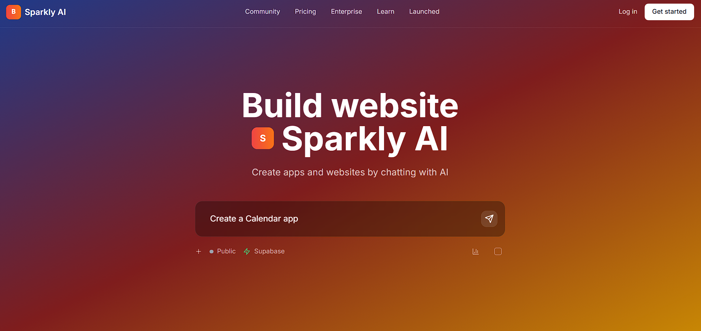
    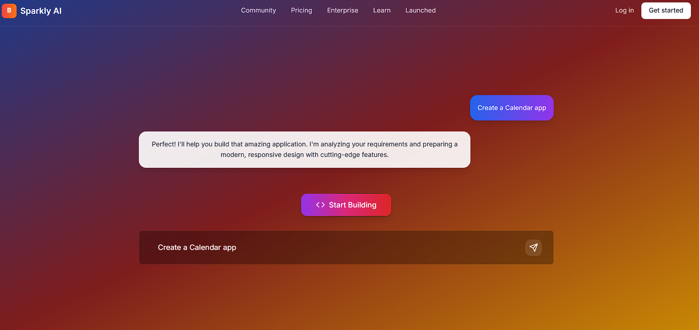
    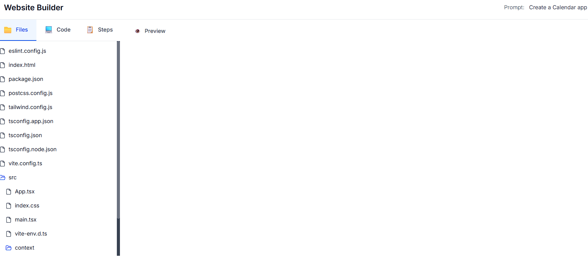
  </p>
  <div><sub>Landing · Prompt input · Build progress</sub></div>

  <p>
    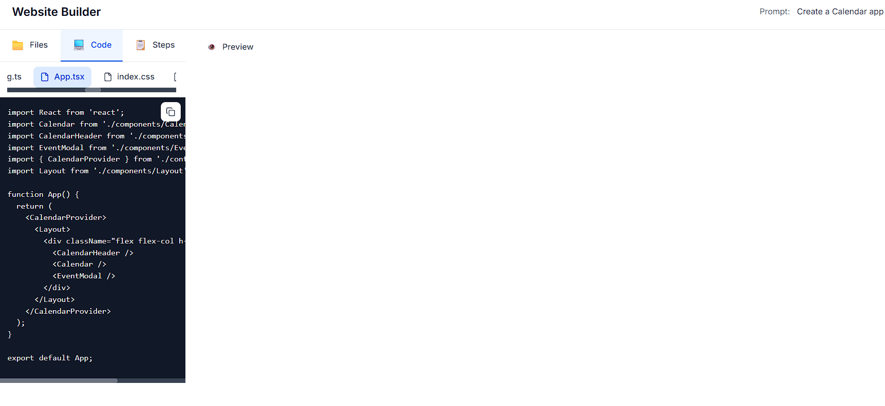
    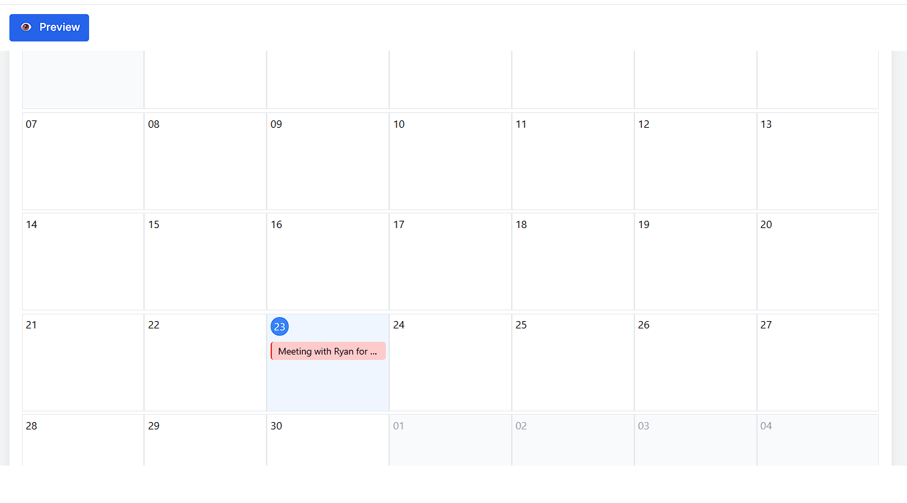
    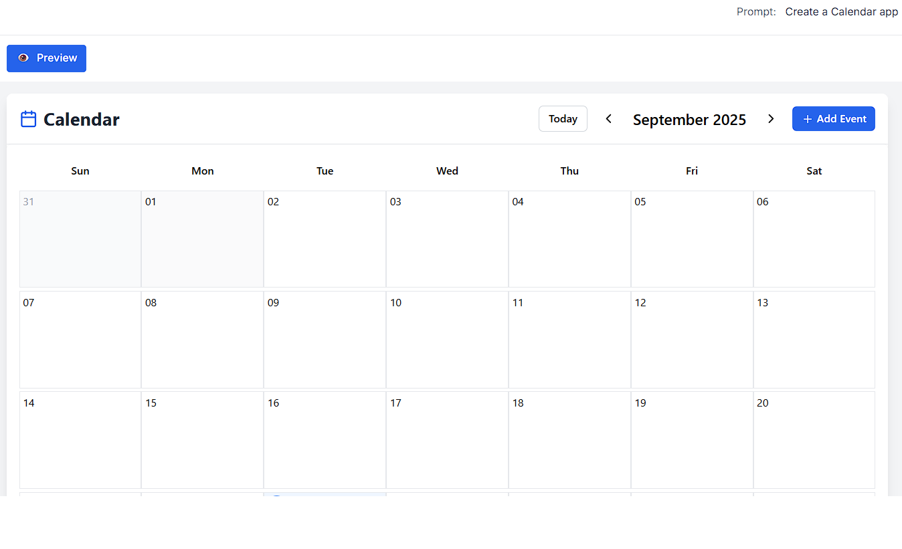
  </p>
  <div><sub>File Explorer · Code Viewer · Live Preview</sub></div>

  <p>
    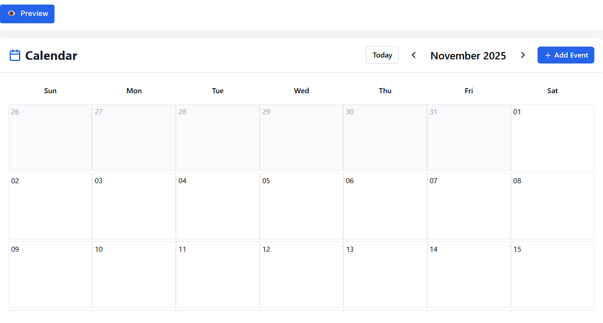
    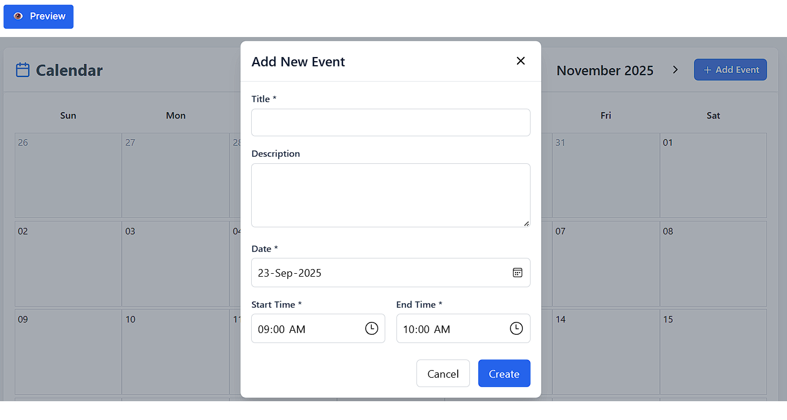
    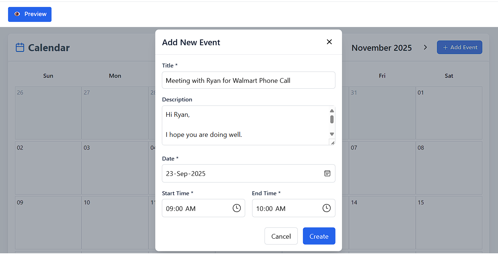
  </p>
  <div><sub>Tabs · Shortcuts · Dark mode</sub></div>

  <p>
    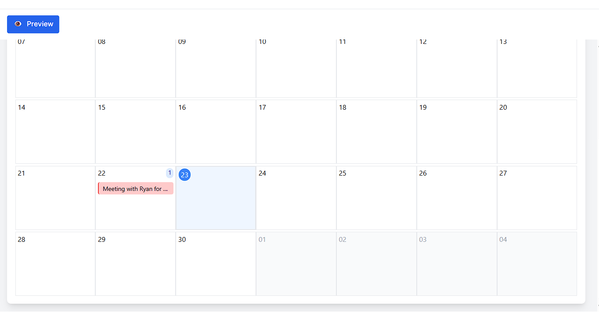
    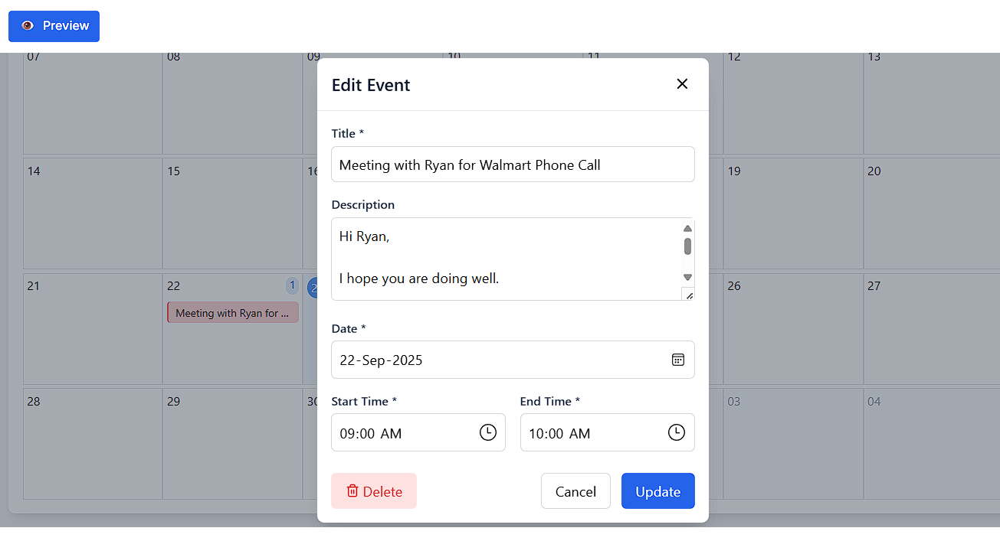
    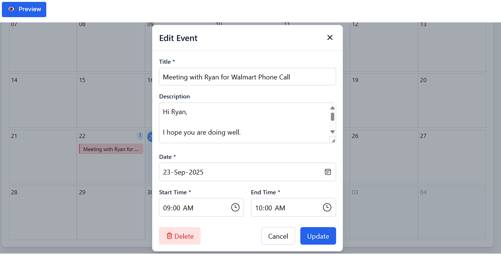
  </p>
  <div><sub>Calendar demo · Modal · Error/empty state</sub></div>

</div>


Add captions by converting each row into a small table if you want per-image labels.

⸻

🧰 Scripts

Frontend
```code
	•	npm run dev — Vite dev server
	•	npm run build — production build
	•	npm run preview — preview built assets
	•	npm run lint — ESLint
```

Backend
```code
	•	npm run dev — TypeScript build + Node runner
```
⸻

🧪 Testing (stubs)
	•	Frontend test scaffolding under frontend/src/__tests__/ for components, hooks, and services.
	•	Wire up Vitest/Jest + CI as needed.

⸻

🗺️ Roadmap Ideas
	•	One-click deploy (Vercel/Netlify)
	•	Multi-page generation with data fetching
	•	Supabase workspace sync
	•	CLI for local codegen
	•	Plugin system for custom templates
